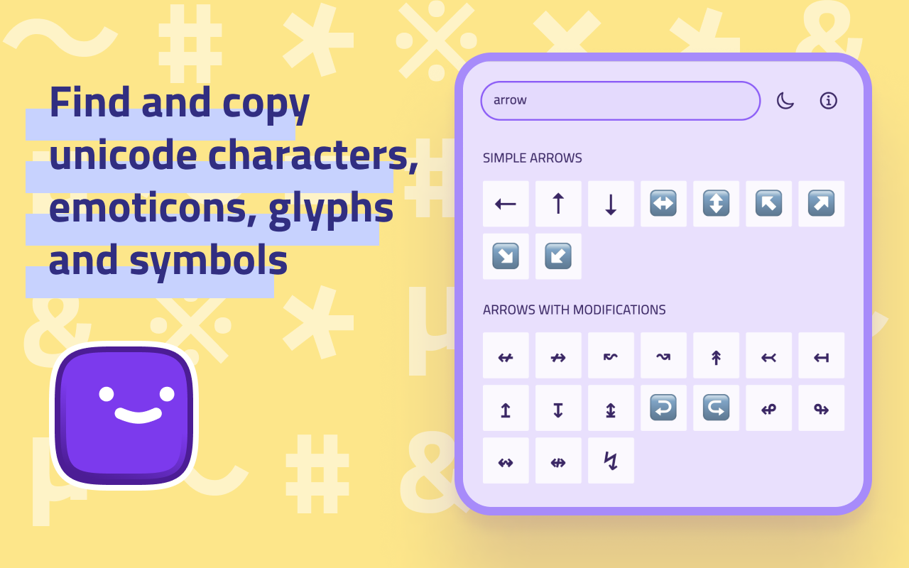
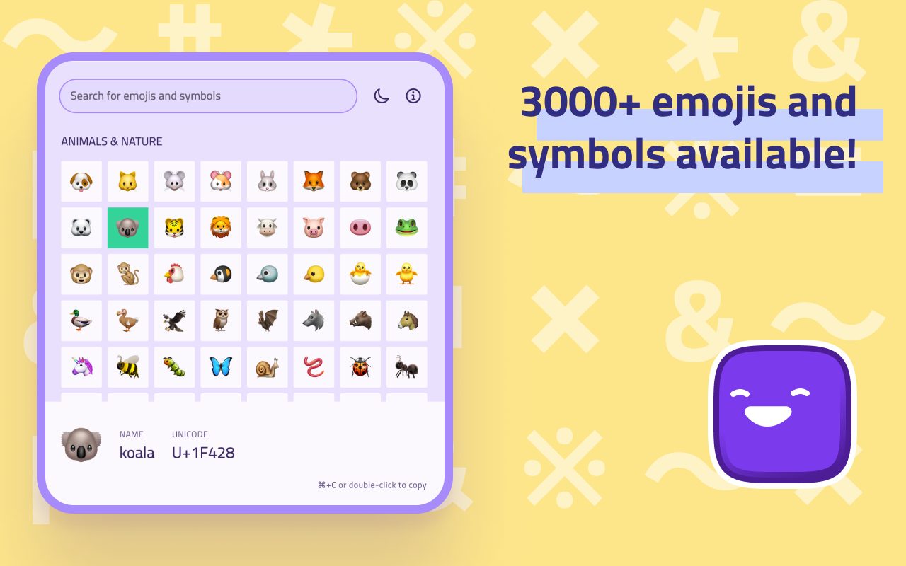
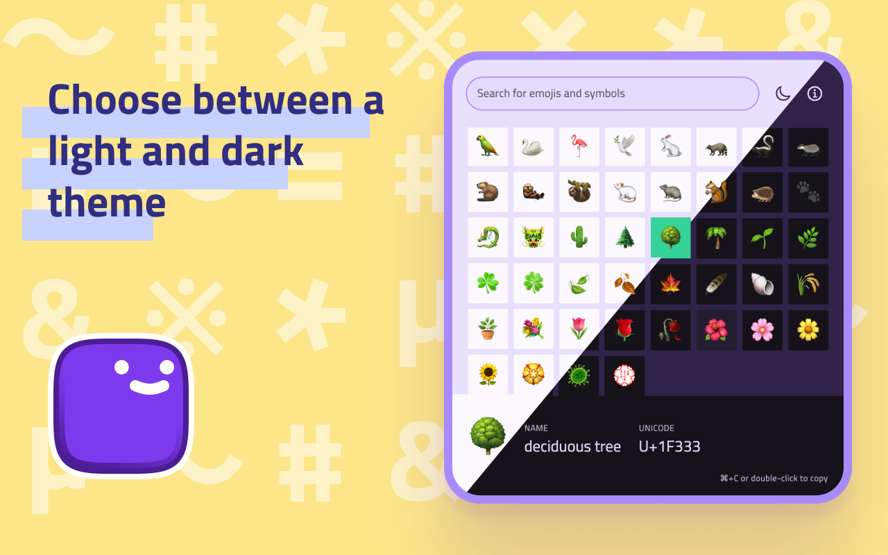
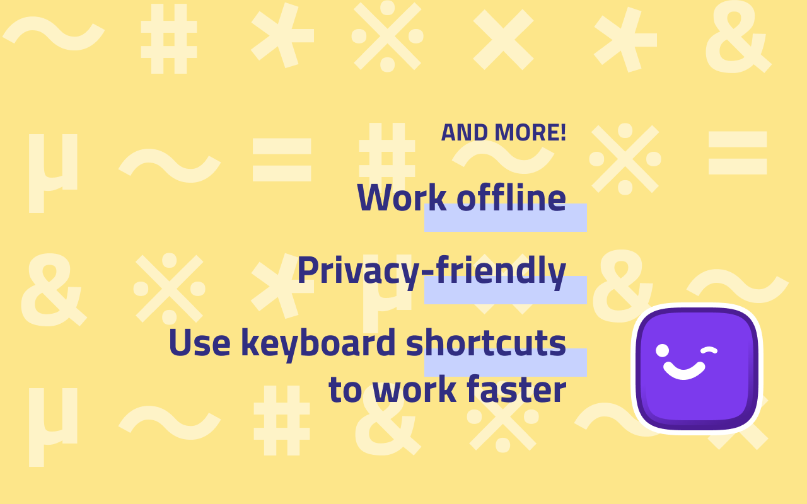

# Ejimo

Find and copy unicode characters, emoticons, glyphs and symbols with Ejimo.

Ejimo is a comprehensive emoji and symbol picker that puts every character you need at your fingertips. Whether you're a
designer, developer or writer, Ejimo makes it easy to find the missing character you need. With over 3000 emojis and
symbols available, Ejimo is the perfect tool for any project, social media strategy, article and presentation.

😊 1800+ emojis and 17000+ symbols available: smileys 😃, people 👥, animals 🐿️, food 🍄, objects 💡, arrows ⇒, letterŠ,
punctuation ⁈, and many more!

✏️️ Copy and paste easily: Just select the emoji or symbol you want, and copy it to your clipboard. It’s that easy!

🔍 Fast search experience: Type any word or keyword, and Ejimo will show you all the matching emoji and symbols.

☀️ Choose between a light and dark theme to match your mood or style.

✈️ Work offline: Ejimo doesn't require an internet connection, so you can use it anytime, anywhere.

🕶️ Privacy-friendly: Ejimo doesn't collect any personal information from you or from your use of the app. Your privacy is
important and respected.

⌨️ Use keyboard shortcuts to work faster:

- Cmd/Ctrl+F to start searching for a character
- Use the arrow keys to navigate between emoji and symbols
- Cmd/Ctrl+C to copy the selected emoji or symbol to your clipboard

It works on all desktop and mobile operating systems: Ejimo is available on macOS 🍏, Windows 🪟, Linux 🐧, iOS 📱 and Android 🤖. 
Oh, and Web 🌐 too!

## Download

Available (for **free**) on the:

- [Web](https://ejimo-app.web.app),
- [macOS App Store](https://apps.apple.com/us/app/ejimo/id1598944603)
- [Windows Store](https://apps.microsoft.com/store/detail/ejimo/9PF0Q1XP8LCX)
- [iOS App Store](https://apps.apple.com/us/app/ejimo/id1598944603)
- [Android Play Store](https://play.google.com/store/apps/details?id=me.albemala.ejimo)
- Linux Snap Store (_Soon_)

Or from the [releases](https://github.com/albemala/emoji-picker/releases) page.

## Development

Ejimo is developed with Flutter. It works on all desktop and mobile operating systems (macOS, Windows, Linux, iOS, Android).

Note: _The app was developed and tested with Flutter stable_.

Setup, how to run and build: https://docs.flutter.dev/desktop

## Support this project

## Other projects

🎨 **[Hexee Pro](https://hexee.app/)** — Palette editor & Advanced color toolkit

🧰 **[exabox](https://exabox.app/)** — Essential tools for developers: All the tools you need in one single app.

[//]: # (😃 **[Ejimo]&#40;https://github.com/albemala/emoji-picker&#41;** — Emoji and symbol picker)

🗺️ **[WMap](https://wmap.albemala.me/)** — Create beautiful, minimal, custom map wallpapers and backgrounds for your phone or tablet.

🎨 **[iro‿iro](https://iro-iro.albemala.me/)** — Rearrange the colors to form beautiful patterns in this relaxing color puzzle game.

## Credits

Created by [@albemala](https://github.com/albemala) ([Twitter](https://twitter.com/albemala))

Emoji data: [unicode-emoji-json](https://github.com/muan/unicode-emoji-json), [emojilib](https://github.com/muan/emojilib)

Symbol data: [Glyphr-Studio-1](https://raw.githubusercontent.com/glyphr-studio/Glyphr-Studio-1/master/dev/js/lib_unicode_blocks.js), [reactos](https://raw.githubusercontent.com/reactos/reactos/master/dll/win32/getuname/lang/en-US.rc) 
